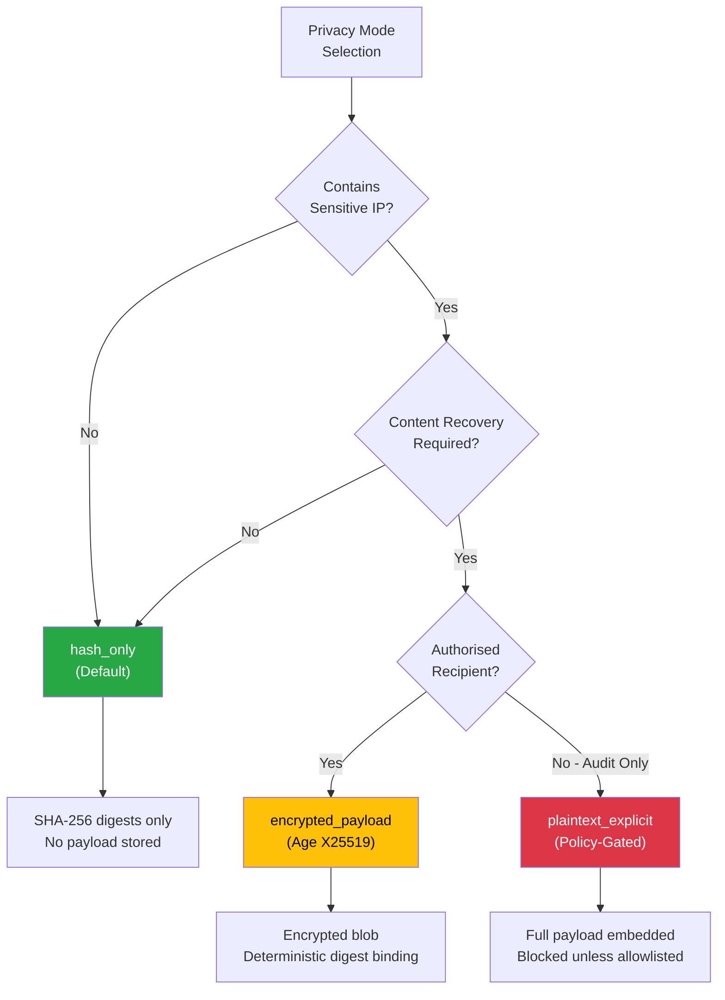
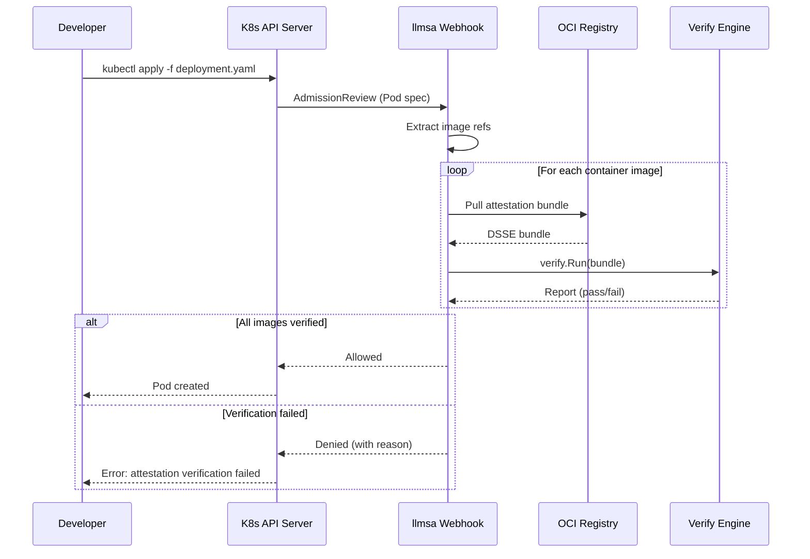
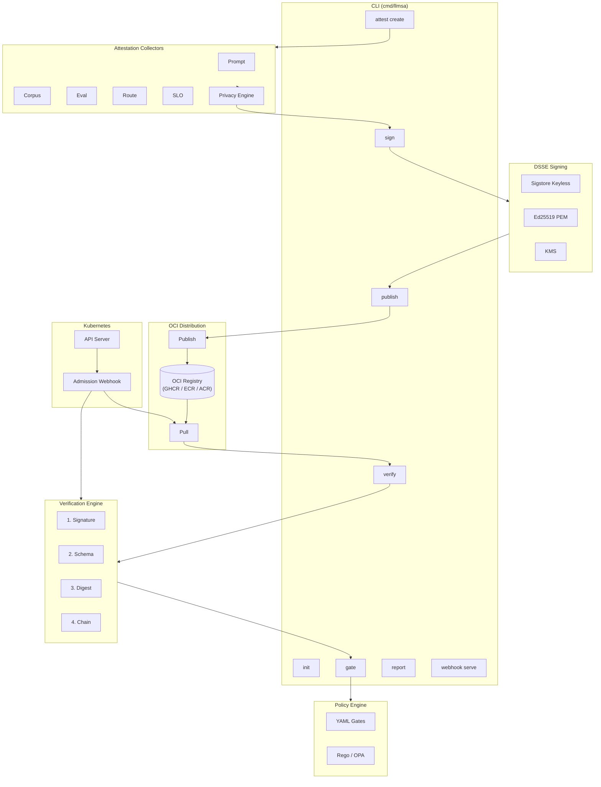
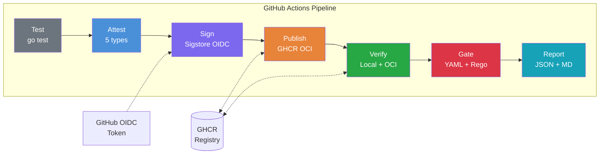

# LLM Supply-Chain Attestation (`llmsa`)

**A cryptographic attestation framework that brings software supply-chain security to large language model lifecycles with typed LLM artifact provenance, policy enforcement, and deployment-time admission checks.**

[](https://github.com/ogulcanaydogan/LLM-Supply-Chain-Attestation/actions/workflows/ci-attest-verify.yml)


---

## The Problem

Existing software supply-chain frameworks (SLSA, in-toto, SBOM) secure traditional build artifacts — container images, binaries, packages — but **completely ignore the AI-specific components** that define LLM system behaviour. Prompts, training corpora, evaluation benchmarks, routing configurations, and latency budgets flow through CI/CD pipelines with no integrity verification, no provenance tracking, and no policy enforcement.

This creates critical blind spots:

- A **system prompt** can be silently modified in production, altering model behaviour without any audit trail.
- **Training data** can be poisoned between preparation and deployment with no tamper detection.
- **Evaluation results** can be fabricated or replayed from stale runs to bypass quality gates.
- **Routing logic** can be changed to redirect traffic to cheaper, less capable models without SLO accountability.

As LLM systems increasingly power safety-critical applications in healthcare, finance, and autonomous systems, the absence of supply-chain integrity for AI artifacts represents a systemic security gap that no existing tool addresses.

## What `llmsa` Does

`llmsa` is a local-first CLI and CI toolchain that generates, signs, publishes, verifies, and enforces **typed cryptographic attestations** for five categories of LLM artifacts:

| Attestation Type | Artifacts Covered | What It Proves |
|---|---|---|
| **Prompt** | System prompts, templates, tool schemas, safety policies | The exact prompts deployed match what was reviewed and approved |
| **Corpus** | Training data, RAG documents, embeddings, vector indices | Data lineage is intact from preparation through indexing |
| **Eval** | Test suites, benchmark results, scoring configs, baselines | Model quality was validated against specific prompt+corpus versions |
| **Route** | Routing tables, fallback graphs, canary configs, budget policies | Traffic routing logic matches the tested and approved configuration |
| **SLO** | Latency targets, cost budgets, accuracy thresholds, query profiles | Operational constraints were defined against the verified routing setup |

Each attestation cryptographically binds file digests to metadata in a signed [DSSE (Dead Simple Signing Envelope)](https://github.com/secure-systems-lab/dsse), creating an unforgeable chain of evidence from development through deployment.

## One-Message Positioning

`llmsa` secures LLM delivery by combining four controls under one operational boundary:

1. **LLM-specific taxonomy** for prompt/corpus/eval/route/SLO changes.
2. **Provenance-chain verification** so downstream decisions are bound to upstream evidence.
3. **Policy enforcement** in CI for deny-on-missing-or-invalid evidence.
4. **Fail-closed admission enforcement** in Kubernetes for deployment-time verification.

## Key Technical Contributions

### 1. LLM-Specific Attestation Taxonomy

Unlike generic artifact attestation tools, `llmsa` introduces a **domain-specific type system** for LLM artifacts. Each attestation type has dedicated collectors that understand the semantic structure of prompts, corpora, evaluations, routing configs, and SLO definitions — extracting the right digests and metadata rather than treating everything as opaque blobs.

### 2. Provenance Chain Verification

`llmsa` enforces a **directed acyclic dependency graph** between attestation types, ensuring logical ordering and referential integrity:

```mermaid
graph LR
    PA["🔤 Prompt\nAttestation"] --> EA["📊 Eval\nAttestation"]
    CA["📚 Corpus\nAttestation"] --> EA
    EA --> RA["🔀 Route\nAttestation"]
    RA --> SA["⚡ SLO\nAttestation"]

    style PA fill:#4A90D9,color:#fff,stroke:#2E6BA6
    style CA fill:#4A90D9,color:#fff,stroke:#2E6BA6
    style EA fill:#7B68EE,color:#fff,stroke:#5A4FCF
    style RA fill:#E8833A,color:#fff,stroke:#C06A2B
    style SA fill:#50C878,color:#fff,stroke:#3BA55D
```



The chain verifier validates:
- **Type-based dependencies**: An eval attestation *must* reference both prompt and corpus attestations.
- **ID-based references**: Explicit `depends_on` annotations link specific statement IDs across the graph.
- **Temporal ordering**: Predecessor attestations must have been generated *before* their successors.
- **Unknown reference detection**: Dangling dependency references are flagged as violations.

This ensures that no attestation can exist in isolation — every claim about model quality (eval) is bound to the exact artifacts (prompt + corpus) it was tested against, and every deployment decision (route, SLO) traces back to verified evaluations.

### 3. Privacy-Preserving Attestation Modes

LLM artifacts often contain sensitive intellectual property (proprietary prompts, confidential training data). `llmsa` provides three privacy modes:



| Mode | Behaviour | Use Case |
|---|---|---|
| `hash_only` | Only SHA-256 digests stored; no payload in statement | Default — proves integrity without exposing content |
| `plaintext_explicit` | Full payload embedded (policy-blocked unless allowlisted) | Auditing scenarios requiring content inspection |
| `encrypted_payload` | Age (X25519) encrypted blob with deterministic digest binding | Compliance workflows where content must be recoverable by authorised parties |

The `encrypted_payload` mode uses [age](https://age-encryption.org/) encryption with a novel deterministic digest-binding scheme: the digest is computed over the concatenation of the recipient public key and source bytes, ensuring the encrypted blob is cryptographically tied to both the content and the intended recipient.

### 4. Dual Policy Engine

Policy enforcement supports two engines to balance simplicity and expressiveness:

- **YAML Gates**: Declarative path-based triggers (`trigger_paths`) that require specific attestation types. Covers ~90% of CI/CD use cases with zero learning curve.
- **Rego (OPA) Engine**: Full Open Policy Agent integration for advanced cross-statement analysis — privacy guards, custom predicates, conditional gates based on attestation metadata.

Both engines share the same input contract and can be used interchangeably or in combination.

### 5. Sigstore Keyless Signing with OIDC Identity Binding

Production signing uses [Sigstore](https://www.sigstore.dev/) keyless mode with OIDC tokens from CI providers (GitHub Actions, GitLab CI). This means:

- **No key management**: No private keys to rotate, store, or protect.
- **Identity-bound signatures**: Attestations are cryptographically tied to the CI workflow identity that produced them (e.g., `github.com/org/repo/.github/workflows/attest.yml@refs/heads/main`).
- **OIDC issuer verification**: The verifier checks that the token issuer matches the expected provider.
- **PEM fallback**: Ed25519 key signing for local development and air-gapped environments.

### 6. OCI-Native Distribution

Signed attestation bundles are published to any OCI-compliant container registry (GHCR, ECR, ACR, Docker Hub) as first-class artifacts with content-addressable digest pinning. This enables:

- Global distribution through existing container infrastructure.
- Immutable references via `registry/repo@sha256:...` digest URIs.
- Pull-based verification from any environment with registry access.

### 7. Kubernetes Admission Enforcement

The `llmsa webhook serve` command runs a **validating admission webhook** that intercepts Pod, Deployment, ReplicaSet, StatefulSet, DaemonSet, and Job creation, pulling attestation bundles from OCI registries and running the full four-stage verification pipeline before allowing resources into the cluster.



### 8. Determinism Validation

The `--determinism-check N` flag runs attestation generation N times and validates that content hashes match (excluding runtime nonces like timestamps and UUIDs). This catches non-deterministic collectors before they produce unreproducible attestations.

## Architecture



## Verification Pipeline

The verification engine performs four independent checks, each producing a specific exit code:

```mermaid
flowchart LR
    Bundle["DSSE\nBundle"] --> S1

    subgraph Pipeline["Four-Stage Verification"]
        S1["1. Signature\nVerify"]
        S2["2. Schema\nValidate"]
        S3["3. Digest\nRecompute"]
        S4["4. Chain\nVerify"]
        S1 -->|pass| S2
        S2 -->|pass| S3
        S3 -->|pass| S4
    end

    S1 -->|fail| F1["Exit 11\nSignature Fail"]
    S2 -->|fail| F2["Exit 14\nSchema Fail"]
    S3 -->|fail| F3["Exit 12\nTamper Detected"]
    S4 -->|fail| F4["Exit 14\nChain Invalid"]
    S4 -->|pass| OK["Exit 0\nAll Checks Passed ✓"]

    style F1 fill:#DC3545,color:#fff
    style F2 fill:#DC3545,color:#fff
    style F3 fill:#DC3545,color:#fff
    style F4 fill:#DC3545,color:#fff
    style OK fill:#28A745,color:#fff
```



| Check | What It Validates | Failure Exit Code |
|---|---|---|
| **Signature** | DSSE envelope signature against public key or Sigstore certificate | `11` |
| **Schema** | Statement structure against JSON Schema for the attestation type | `14` |
| **Digest** | Recomputed SHA-256 of referenced files matches statement subjects | `12` |
| **Chain** | Provenance graph satisfies dependency, ordering, and reference constraints | `14` |

## Tamper Detection Test Suite

`llmsa` ships with a comprehensive 20-case tamper detection suite (`scripts/tamper-tests.sh`) that validates security guarantees across three attack surfaces:

**Subject/Material Byte Mutations (T01–T10)**: Single-byte modifications to each artifact type (system prompts, templates, tool schemas, safety policies, document manifests, chunking configs, embeddings, test sets, route configs, SLO profiles) — all detected via digest recomputation (exit 12).

**Signature/Bundle Tampering (T11–T14)**: Signature corruption, public key substitution, statement hash manipulation, and signature removal — all caught by DSSE verification (exit 11).

**Schema and Chain Integrity (T15–T20)**: Missing required predicate fields, invalid timestamps, malformed digests, incomplete dependency chains, and dangling references — all rejected by schema and chain validation (exit 14).

## Quick Start

```bash
# Build and initialise
go build -o llmsa ./cmd/llmsa
./llmsa init

# Generate all five attestation types
./llmsa attest create --type prompt_attestation --config examples/tiny-rag/configs/prompt.yaml --out .llmsa/attestations
./llmsa attest create --type corpus_attestation --config examples/tiny-rag/configs/corpus.yaml --out .llmsa/attestations
./llmsa attest create --type eval_attestation   --config examples/tiny-rag/configs/eval.yaml   --out .llmsa/attestations
./llmsa attest create --type route_attestation  --config examples/tiny-rag/configs/route.yaml  --out .llmsa/attestations
./llmsa attest create --type slo_attestation    --config examples/tiny-rag/configs/slo.yaml    --out .llmsa/attestations

# Sign with local PEM key (development)
for s in .llmsa/attestations/statement_*.json; do
  ./llmsa sign --in "$s" --provider pem --key .llmsa/dev_ed25519.pem --out .llmsa/attestations
done

# Verify signatures, schemas, digests, and provenance chain
./llmsa verify --source local --attestations .llmsa/attestations \
  --policy policy/examples/mvp-gates.yaml --format json --out verify.json

# Enforce policy gates against changed files
./llmsa gate --policy policy/examples/mvp-gates.yaml \
  --attestations .llmsa/attestations --git-ref HEAD~1

# Generate human-readable audit report
./llmsa report --in verify.json --out verify.md
```

## CI/CD Integration

The included GitHub Actions workflow (`.github/workflows/ci-attest-verify.yml`) demonstrates production-grade integration:



## CLI Reference

| Command | Description |
|---|---|
| `llmsa init` | Bootstrap project config, policy scaffold, and local dev key |
| `llmsa attest create` | Generate a typed attestation statement |
| `llmsa sign` | Wrap a statement in a signed DSSE bundle |
| `llmsa publish` | Push a bundle to an OCI registry |
| `llmsa verify` | Validate signatures, schemas, digests, and chain |
| `llmsa gate` | Enforce policy gates (exit 13 on violation) |
| `llmsa report` | Convert JSON verification output to Markdown |
| `llmsa webhook serve` | Start the Kubernetes validating admission webhook server |
| `llmsa demo run` | Execute the full end-to-end pipeline |

### Exit Codes

| Code | Meaning |
|---|---|
| `0` | All checks passed |
| `10` | Missing attestation or bundle |
| `11` | Signature verification failure |
| `12` | Subject digest mismatch (tamper detected) |
| `13` | Policy gate violation |
| `14` | Schema or version incompatibility |

## Technology Stack

| Component | Technology | Purpose |
|---|---|---|
| Language | Go 1.25 | Performance, single-binary distribution, strong typing |
| CLI Framework | Cobra | Subcommand routing, flag parsing, help generation |
| Signing (production) | Sigstore | Keyless OIDC-based signing and verification |
| Signing (development) | Ed25519 PEM | Local offline signing |
| Encryption | age (X25519) | Privacy-preserving encrypted attestation payloads |
| Policy (simple) | YAML Gates | Declarative path-trigger policy enforcement |
| Policy (advanced) | Open Policy Agent | Rego-based cross-statement policy evaluation |
| Schema Validation | gojsonschema | JSON Schema validation for all statement types |
| OCI Distribution | go-containerregistry | Publish/pull attestation bundles to/from registries |
| Envelope Format | DSSE | Industry-standard signing envelope (in-toto compatible) |
| Admission Control | K8s Admission API v1 | Deployment-time attestation enforcement |

## Project Structure

```
cmd/llmsa/              CLI entry point and command definitions
internal/
├── attest/             Typed collectors (prompt, corpus, eval, route, slo) + privacy
├── sign/               DSSE bundle creation (sigstore, pem, kms providers)
├── verify/             Multi-stage verification engine + provenance chain validator
├── policy/
│   ├── yaml/           Declarative gate engine
│   └── rego/           OPA integration engine
├── store/              OCI registry publish/pull with digest pinning
├── hash/               Canonical JSON serialisation and tree hashing
├── report/             Markdown report generator
└── webhook/            Kubernetes validating admission webhook handler
pkg/types/              Shared type definitions (Statement, Privacy, etc.)
policy/examples/        Reference YAML and Rego policy files
examples/tiny-rag/      Complete working RAG system with all 5 attestation types
deploy/
├── webhook/            Kubernetes manifests (Deployment, Service, ValidatingWebhookConfiguration)
└── helm/               Helm chart for webhook deployment
test/e2e/               End-to-end integration tests
scripts/
├── benchmark.sh        Performance benchmarks with reproducibility metrics
├── tamper-tests.sh     20-case security validation suite
└── public-footprint-snapshot.sh  Public metrics snapshot for external evidence tracking
docs/
├── quickstart.md       Step-by-step bootstrap guide
├── threat-model.md     Threat coverage and mitigation analysis
├── policy-guide.md     Gate model and privacy guard documentation
├── benchmark-methodology.md  Benchmark design and limitations
├── k8s-admission.md    Kubernetes validating webhook deployment guide
└── public-footprint/   30-day external validation playbook and evidence templates
```

## Documentation

- [Quick Start Guide](docs/quickstart.md) — Bootstrap and run the full pipeline in 6 steps.
- [Threat Model](docs/threat-model.md) — Attack surfaces, mitigations, and known limitations.
- [Policy Guide](docs/policy-guide.md) — Gate configuration, privacy guards, and Rego integration.
- [Benchmark Methodology](docs/benchmark-methodology.md) — Determinism, tamper detection, and performance benchmarks.
- [Kubernetes Admission](docs/k8s-admission.md) — Validating webhook deployment, configuration, and troubleshooting.
- [Public Footprint Playbook](docs/public-footprint/README.md) — 30-day external validation execution plan and evidence templates.
- [Positioning Message](docs/public-footprint/positioning.md) — single technical narrative for external communication consistency.
- [Evidence Baseline](docs/public-footprint/evidence-baseline.md) — Day-0 public signal inventory and gap analysis.
- [Measurement Dashboard](docs/public-footprint/measurement-dashboard.md) — Day-0 to Day-30 metric tracker.
- [Case Study Template](docs/public-footprint/case-study-template.md) — Anonymous pilot study template with reproducibility sections.
- [Evidence Pack Template](docs/public-footprint/evidence-pack-template.md) — Copy-ready claim-to-URL evidence format.
- [What We Do Not Claim](docs/public-footprint/what-we-do-not-claim.md) — explicit scope limits and non-claims.

## What `llmsa` Does Not Claim

- It does not prevent runtime prompt injection or jailbreak attacks by itself.
- It does not guarantee model quality; it enforces traceable evidence and policy gates.
- It does not replace security review, threat modeling, or compliance assessment.
- It does not claim universal performance across all workloads and environments.

## Roadmap

- **v1.0** (shipped): Kubernetes validating admission webhook for deployment-time attestation enforcement.
- **Rekor integration**: Transparency log proofs for public auditability.
- **KMS provider**: AWS KMS / GCP Cloud KMS / Azure Key Vault signing backends.
- **Multi-model chain attestations**: Cross-model dependency tracking for ensemble and pipeline architectures.
- **SBOM correlation**: Linking LLM attestations with traditional software bill of materials.

## License

Apache 2.0
